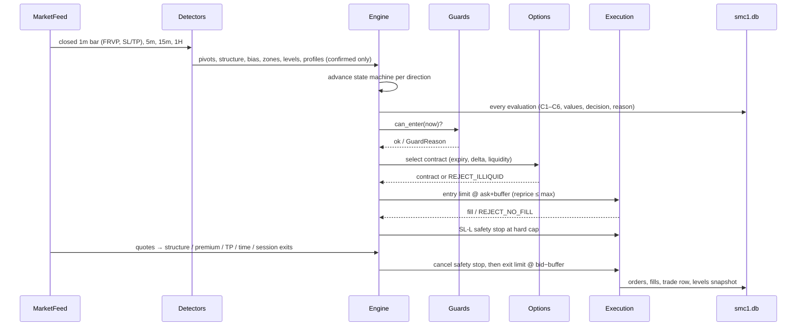
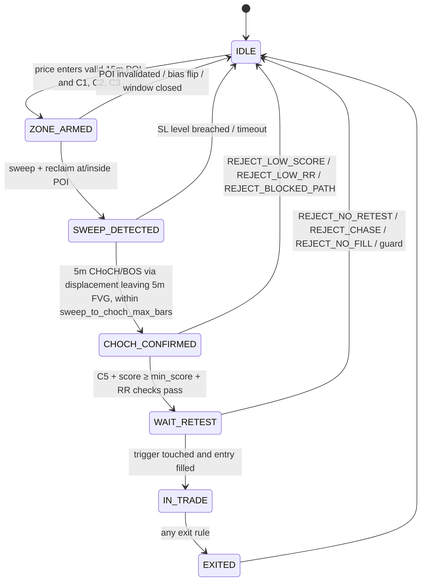

# SMC_RSI_FRVP_OPTIONS_V1 — Design (Phase A)

**Status:** Phase A approved with changes on 2026-10-01 (§12). The phase
plan is revised (§15): an **edge-validation phase B2 with a GO/NO-GO gate**
(§16) now sits between the detectors and the strategy engine. No source code
changed in Phase A. `active_strategy` remains `ema9_rsi_momentum`. All smc1
work happens on branch `feature/smc1`.

**Package name:** `smc_rsi_frvp_options_v1` · **Short id / table prefix:** `smc1`
· **Versioned id for logs and journal rows:** `SMC_RSI_FRVP_OPTIONS_V1`

**Baseline recorded before this phase (2026-10-01, branch
`trading-bot_V3.15.0`, working tree as found):**
`pytest ../Testing_Automation_AI_Trading_Bot/python-unit` →
**1812 passed, 1 skipped, 2 xfailed** in 104.8 s.

---

## 0. Read this first — seven findings that change the spec

The audit found seven facts that the prompt did not assume. Each one either
blocks a phase or changes what a phase can prove. Section 12 turns them into
decisions for the owner.

| # | Finding | Consequence |
|---|---|---|
| F1 | **The UI is Next.js 16 / React 19, not Angular.** `frontend/` is a Next.js app-router project with `lightweight-charts` 5.2. | Every "Angular" item becomes a Next.js page + `app/api/*` route. `ng build` becomes `npm run build` + `npm run lint`. |
| F2 | **The live broker is Fyers, not Zerodha Kite.** `broker_factory` defaults to `fyers`; the whole live, paper and recorder stack runs on Fyers. `kite_broker.py` exists but its live stream is a **synthetic fallback** ("KiteTicker bridge not yet wired") and it has **no historical-data method**. | The spec's Kite references map to Fyers. Running on Kite would feed the strategy fabricated ticks — the class of defect the V3.13.0 audit removed. |
| F3 | **The repository holds no futures data at all.** `trading-system/data/` is index spot only; the 2024 NIFTY block has `volume.nunique() == 1` (no real volume). The Fyers adapter already sends `cont_flag=1`, but no continuous-futures history has ever been fetched, and its depth for 1-minute bars is unverified. | FRVP, F3 (absorption), F4 (CVD) and F5 (VWAP) all need real futures volume. **Phase B can use synthetic fixtures; Phase E cannot start until ≥6 months of 1-minute NIFTY futures is fetched and audited.** |
| F4 | **No historical option premium exists or can be obtained.** Fyers returns "Invalid symbol" for expired contracts (Phase 11). The repo's "option history" endpoint is a Black–Scholes transform of spot with hard-coded `sigma=0.18`. The premium model is measured as **4–8.5 % optimistic per trade** (see `backtest_model_miscalibration`). | Every Phase E backtest is `SIMULATED_PREMIUM`. **Go-live gate 1 (backtest OOS PF ≥ 1.3) cannot be passed on simulated premium alone** without that being stated on the dashboard. |
| F5 | **This strategy family has already been researched here, to NO-GO.** `rsi_smc_options_buyer` (RSI + SMC + liquidity sweeps, NIFTY 5 m) went through Phases 8–11 (`docs/research/RSI_SMC_PHASE*.md`). Findings: stacking filters on top of structure + RSI *destroyed* directional information (bull MFE/MAE 1.036 → 0.632 after trigger and R:R gates); the one surviving effect (+~2 underlying points per trade at prior-day extremes) is **below the cost of buying an option** in 11 of 12 exit × split cells. | This spec adds more mandatory filters (C1–C5, score ≥ 4, RR ≥ 2) to the same family. That is the pattern Phase 8 measured as harmful. Not a reason to refuse the build — it is a reason for Phase E to measure each stage's information contribution, as Phase 8 did, instead of only reporting final P&L. |
| F6 | **The institutional-footprint data is not being collected.** `research/option_recorder` is built and hardened, but `audit` reports **0 COMPLETE sessions, 0 observations** as of today. It polls the chain every 300 s via `api_bridge`; it records no futures OI, no 1-minute bars, no heavyweights. | F1–F6 cannot be validated until the spec's §14.1 recorder runs for ≥30 evaluated setups (gate 6). Every session not recorded pushes that date out. |
| F7 | **The engine's strategy contract is stateless and main.py owns execution.** The registry calls `generate_signals(df, **settings) -> Series[{-1,0,1}]`; `trading_bot/main.py` does option mapping, market-order entry, exits, SL-M exchange stop and reconciliation, with strategy-specific branches hard-coded inside it (the rsi_smc exit hook is at `main.py:1882`). | The spec's state machine, limit-and-reprice entries, TP1 partials, SL-L broker stop and own sizing **cannot be delivered through the registry without editing main.py.** The additive route is a separate book process (§3.2). |

---

## 1. Repository map (as audited)

| Area | What exists | Where |
|---|---|---|
| Languages | Python 3.14.3 (venv), TypeScript 5 / Next.js 16.3.4 / React 19.2.4 | `trading-system/venv`, `frontend/package.json` |
| Strategy contract | `generate_signals(df, **kwargs) -> pd.Series`; module constants `STRATEGY_NAME`, `SKIP_INSTITUTIONAL_FILTERS` / `OWNS_INSTITUTIONAL_FILTERS` | `trading_bot/strategies/registry.py` (auto-discovers files and packages) |
| Existing strategies (13) | `ema_rsi`, `enhanced_ai`, `advanced_ai`, `buy_the_dip`, `ema_crossover_pro`, `meta_agent`, `marl`, `drl_strategy`, `ultra_meta_dip_swarm`, `premium_selection/`, `momentum_strategy/`, `momentum_15_5/`, `structure_break/`, `ema9_rsi_momentum/` (active), `rsi_smc_options_buyer/`; plus `premium`, `drl_strategy`, `MARL_Ultra` registered in `main.py` | `trading_bot/strategies/` |
| Live engine | Async tick processor, option mapping, exits, exchange SL, reconciliation, kill/panic | `trading_bot/main.py` (3,568 lines) |
| Paper books | `paper_observer.py` (main paper book, never runs with main.py), `ema9_variant_observer.py` (isolated shadow books under `paper_obs_logs/variants/`) | `trading-system/` |
| Orchestrator | Starts exactly one book from the Live/Paper toggle, plus the variant books; supervises; EOD | `auto_daily_session.py` |
| API | FastAPI REST + WebSocket bridge; single Fyers websocket; option chain with real quotes | `api_bridge.py` (5,246 lines) |
| Broker layer | `BaseBroker` ABC, `OrderRequest` (`MARKET`/`LIMIT`/`SL`/`SL_M`, `tag`), Fyers / Kite / Angel adapters, history CSV cache, token cache | `brokers/` |
| Indicators | `atr`, `rsi` (Wilder), `adx`/`dmi` (Wilder), `rsi_divergence`, `smart_money_concepts.calculate_smc` + `detect_pivots`, `volume_profile.calculate_fixed_range_volume_profile`, `supertrend`, `macd`, `ema` | `shared/indicators/` |
| SMC causality | Causal/analytical split over `calculate_smc`, lifecycle with recovered confirmation bars | `rsi_smc_options_buyer/structure.py`, `smc_lifecycle.py`, `docs/SMC_FEATURE_CAUSALITY.md` |
| Risk | `RiskManager` (daily loss, sizing, risk-off), `portfolio_guard`, `tick_staleness`, `option_stop_loss` | `shared/risk/` |
| Exits | `SmartExitEngine`, `PyramidSizer`, ema9 `exit_ladder` | `shared/exits/`, `ema9_rsi_momentum/exit_ladder.py` |
| Calendar / session | NSE holidays, market hours, EOD policy, expiry-day detection | `shared/market_calendar.py`, `market_hours.py`, `eod_policy.py` |
| Instruments | Symbol normalisation, paper-test set, UI-selected trade set, lot-size updater from the exchange master | `shared/instruments.py`, `shared/lot_size_updater.py` |
| Greeks | `calculate_greeks` (fixed vol, no IV solve) in `premium_selection`; an inline `black_scholes` inside `api_bridge.py` | not importable as a clean library |
| Alerts | Telegram with outbox spool; Discord | `shared/alerts/` |
| Security | Token-bucket `RateLimiter`, audit log, credential vault | `shared/security/` |
| Persistence | SQLite `state.db` via `shared/state.py`, schema created inline (`CREATE TABLE IF NOT EXISTS` + guarded `ALTER`). **No migration tool.** JSON files in `config/`. JSONL partitions in `research/option_recorder/store.py` | |
| Config | Flat `config/settings.json` with per-strategy prefixed keys, read by a per-strategy dataclass (`RsiSmcConfig.from_settings`, `rsi_smc_<field>`). **PyYAML is not installed.** | |
| Tests | 1,812 pytest tests in `Testing_Automation_AI_Trading_Bot/python-unit` (+ 6 legacy files in `trading-system/tests`), Playwright UI suite (run with `--workers=1`) | |
| Research apparatus | Validation harness, option recorder (pre-flight, collect, eod, audit, incidents) | `validation_harness/`, `research/option_recorder/` |
| Data on disk | 5 m index spot for NIFTY/BANKNIFTY/SENSEX/FINNIFTY, 1 m/3 m/15 m NIFTY spot. **No futures, no options, no VIX history.** | `trading-system/data/` |

---

## 2. Reuse Map

"Reuse" = import unchanged. "Wrap" = new file composing the existing
function. "New" = nothing existing covers it (reason given). Nothing in this
table modifies an existing file.

| Spec need | Decision | Existing code | Notes |
|---|---|---|---|
| Pivots (3.1) | **Reuse** | `shared/indicators/smart_money_concepts.detect_pivots` | Strict extremum over `[i-L, i+L]`. Symmetric only → spec's `pivot_left ≠ pivot_right` not supported (defaults are symmetric; see Deviations). Confirmation at `p + L` enforced by our wrapper. |
| BOS / CHoCH (3.2) | **Decision D1** | `calculate_smc` + `rsi_smc_options_buyer.structure` causal adapter | `calculate_smc` uses close-based breaks of the last swing — matches 3.2. But it is a frame-level batch function; the causal adapter recomputes it once per closed bar, which is O(n²) over a backtest and **window-dependent** (Phase 8: 24 vs 26 entries depending on history length). That conflicts with "one identical, deterministic code path". See §12 D1. |
| FVG (3.6) | **Reuse via D1** | `calculate_smc` FVG block | Same rule (`low[i] > high[i-2]`, 0.25 × ATR minimum). Its ATR is the non-Wilder `ema(span)` variant. |
| Order Block (3.7) | **New** (small) | engine's OB differs | Engine picks the last opposite candle with body ≥ 0.3 ATR and zone `[low, body-top]`. Spec: last opposite-bodied candle before the displacement leg, zone `full` or `body`. Changing the engine would change `rsi_smc` and the chart overlay, so a spec-exact OB selector lives in the new package. |
| Liquidity pools + sweeps (3.8) | **Wrap** | `rsi_smc_options_buyer/levels.py`, `liquidity.py` | PDH/PDL/PDC and prior-session levels reused; EQH/EQL tolerance, opening range and the spec's reclaim-within-N-bars sweep rule are new code in a wrapper. |
| FRVP (3.9) | **Wrap** | `volume_profile.calculate_fixed_range_volume_profile` | Called with `num_bins = ceil(range / frvp_bin_points)`. Our wrapper adds the spec's 3-bin smoothing and HVN/LVN thresholds over the returned bins; POC/VAH/VAL taken from the engine after verifying its value-area expansion rule matches (Phase B test). |
| RSI (3.10) | **Reuse** | `shared/indicators/rsi.rsi` | Wilder. No warm-up NaNs — wrapper masks the first `rsi_length` bars. |
| RSI divergence | **Wrap/New** | `rsi_divergence.calculate_rsi_divergences` | Uses its own pivot lookback and a 40-bar window; spec needs "last two *confirmed* 5 m pivot lows within 30 bars". Phase B checks it for look-ahead; if it reads unconfirmed pivots it is not used. |
| ATR (3.11) | **Decision D6** | `shared/indicators/atr.atr` | **Not Wilder**: `ewm(span=14)` = α 2/15, not 1/14. `adx._wilder_smooth` exists but is private. |
| ADX (3.12) | **Reuse** | `shared/indicators/adx.adx` | Wilder. |
| HTF resampling | **Reuse** | `rsi_smc_options_buyer/regime.py` 15 m bucketing (fixed after the Phase 7 `datetime64[us]` bug), `shared/closed_bars.py`, `shared/timeframes.py` | Closed bars only. |
| Session / holidays / expiry day | **Reuse** | `shared/market_calendar`, `market_hours`, `eod_policy.is_expiry_day` | |
| Instrument master, lot size, strike step | **Reuse + Wrap** | `shared/lot_size_updater.py` (exchange master), Fyers symbol master | Wrapper adds expiry list and tick size. Nothing hard-coded. |
| IV solve + delta | **New** | only fixed-vol `calculate_greeks` and an inline BS inside `api_bridge.py` | A pure `black_scholes.py` + Brent IV solve (scipy 1.17 present). Not importable from `api_bridge` without importing the FastAPI app. |
| Option quotes / chain | **Reuse** | `broker.get_market_data()` (`MarketQuote` bid/ask/volume); `api_bridge /api/option-chain` for OI | OI is not on the engine path (documented in `rsi_smc.approve_contract`); the new book reads the chain over HTTP from `api_bridge`, the way the recorder does. |
| Liquidity screen (§5) | **Wrap** | `rsi_smc_options_buyer.approve_contract` | Reuse its spread/two-sided/staleness checks; add OI and the absolute-spread floor. |
| Sizing | **New** (formula) + **Reuse** (`RiskManager` limits) | `shared/risk/manager.RiskManager` | Spec sizing (risk budget ÷ premium-SL distance, grade multiplier) differs from `calculate_position_size`. Daily/weekly limits reuse `RiskManager` in its own instance. |
| Cost model | **Decision D7** | cost constants in `backtesting_engine/premium_ladder.option_cost_profile` and paper books | Phase B looks for one importable cost function; if none, a new `costs.py` with rates in config, cited from the measured values. |
| Order placement / cancel / modify / order book | **Reuse** | `BaseBroker.place_order`, `cancel_order`, `modify_order`, `get_order_book`, `_find_matching_pending_order` | `LIMIT` and `SL` (= Fyers type 4, SL-limit) exist. |
| Order tag / idempotency | **Gap → D5** | `OrderRequest.tag` exists, **but `FyersBroker.place_order` never sends it** (no `orderTag` in the payload). | |
| Paper fill model | **New** | `OrderResponse.paper` fills instantly at request price | Spec needs ask/bid + slippage + latency. New `PaperExecution` adapter. |
| Reconciliation | **New** (own book) | `trading_bot/reconciliation.compute_reconciliation` (for main.py's positions) | Its decision logic is reusable for our own ledger; see D3 for account sharing. |
| Kill switch | **New** (own book) + **Reuse** endpoint pattern | `app/api/panic-exit`, `main._emergency_flatten_all_positions` | |
| Rate limiting | **Reuse** | `shared/security/rate_limiter.RateLimiter` | One instance per book; see §4 on the shared account budget. |
| Staleness | **Reuse** | `shared/risk/tick_staleness` | |
| Telegram | **Reuse** | `shared/alerts/telegram.alerter` | Messages prefixed `SMC1` (and `SHADOW TEST` in PAPER), as the variant books do. |
| Market data recorder (§14.1) | **Decision D4** | `research/option_recorder` (store, schema, pre-flight, eod, audit) | Reuse its store/schema/QA apparatus; the 1-minute futures/OI/heavyweight capture is new. |
| Backtest engine | **Reuse** harness pattern, **New** replay | `validation_harness/`, `backtesting_engine/` | `premium_ladder` is spot-derived with miscalibrated constants — not used for premium. New event-driven replay drives the *same* engine object as PAPER. |
| Chart | **Reuse** | `lightweight-charts` 5.2, `components/native-chart.tsx`, `/api/rsi-smc-overlay` pattern | Overlay served from Python (one implementation — the chart never recomputes signals). |

**Existing strategies confirmed untouched:** all 13 packages/modules above,
their configs, tests, `state.db` tables and UI. The new package is not added
to `settings.json`'s `active_strategy` choices, so `main.py` and
`paper_observer.py` never evaluate it.

---

## 3. Project Fit Analysis

### 3.1 Lifecycle and extension points

The registry contract is stateless (one Series per call) and execution lives
in `main.py`. The spec needs a persistent per-POI state machine, its own
order types, partial exits and its own sizing. Three routes were considered:

| Route | Additive? | Delivers the spec? |
|---|---|---|
| A. Register `generate_signals` and let main.py trade it | Yes | **No.** main.py would enter at market, size its own way and run its own exits. Spec §6–§8 would need main.py branches like the rsi_smc M1 hook. |
| B. Registry plugin + new hooks in main.py | **No** (main.py edits) | Yes |
| **C. A separate book process** (the `ema9_variant_observer.py` pattern) | **Yes** for BACKTEST and PAPER | **Yes** — the book owns its state machine, execution adapter, ledger and store. |

**Recommended: C.** Still also export a `generate_signals` (entry direction
only, for the chart's strategy-markers endpoint and the validation harness),
registered through the normal auto-discovery — additive, never selected as
`active_strategy`.

```mermaid
flowchart LR
  subgraph existing[Existing — unchanged]
    AB[api_bridge.py<br/>Fyers WS + REST]
    MAIN[main.py / paper_observer.py]
    ORCH[auto_daily_session.py]
    REC0[research/option_recorder]
  end
  subgraph new[New — smc_rsi_frvp_options_v1]
    RUN[smc1_book.py<br/>process entry point]
    FEED[MarketFeed<br/>Replay | Live]
    DET[detectors/*<br/>pure, causal]
    ENG[engine.py<br/>scorecard + state machine]
    GUARD[guards.py]
    OPT[options/*<br/>master, IV, delta, screen]
    SIZE[sizing.py + costs.py]
    EXE[execution/*<br/>Paper | Backtest | Live]
    STORE[(smc1.db)]
    MREC[market_recorder]
    API[api_bridge router<br/>/api/v1/strategies/smc1]
  end
  AB -- quotes / chain / history over HTTP --> FEED
  AB -- chain, WS --> MREC
  FEED --> DET --> ENG
  GUARD --> ENG
  ENG --> OPT --> SIZE --> EXE
  EXE --> STORE
  ENG --> STORE
  MREC --> STORE2[(recorder partitions)]
  STORE --> API --> UI[Next.js /smc1 pages]
  ORCH -. D2: needs approval .-> RUN
```

Engine interface (identical in all three modes — only `MarketFeed` and
`ExecutionAdapter` differ):

```python
class Smc1Engine:
    def __init__(self, cfg: Smc1Config, feed: MarketFeed, execution: ExecutionAdapter,
                 store: Smc1Store, clock: Clock, notifier: Notifier) -> None: ...
    def on_bar(self, tf: Timeframe, bar: Bar) -> None: ...      # closed bars only
    def on_quote(self, quote: Quote) -> None: ...               # SL/TP monitoring
    def on_order_event(self, event: OrderEvent) -> None: ...
    def restore(self) -> None: ...                              # resume from smc1.db
    def shutdown(self, reason: ShutdownReason) -> None: ...
```

### 3.2 Spec name → project name

| Spec | Project |
|---|---|
| `strategies/smc_rsi_frvp_options_v1/` | `trading-system/trading_bot/strategies/smc_rsi_frvp_options_v1/` |
| book runner | `trading-system/smc1_book.py` (sibling of `ema9_variant_observer.py`) |
| `config/strategies/smc_rsi_frvp_options_v1.yaml` | `trading-system/config/strategies/smc_rsi_frvp_options_v1.json` + typed dataclass `config.py` holding every default (D8) |
| `config/event_calendar.yaml` | `trading-system/config/strategies/smc1_event_calendar.json` (same shape as `config/market_holidays.json`) |
| DB migrations | New SQLite file `trading-system/state/smc1.db` (or `smc1.db` beside `state.db`), schema versioned with `PRAGMA user_version` inside the new package. `state.db` untouched. |
| `smc1_*` tables | unchanged names, inside `smc1.db` |
| `/api/v1/strategies/smc1/...` | FastAPI `APIRouter` in a new module, served by the smc1 process on its own port (owner decision; RA2 not used), proxied by Next.js routes under `frontend/app/api/smc1/*` (the existing proxy pattern) |
| Angular feature module | Next.js pages `frontend/app/smc1/{page,live,signals,journal,performance,config}` + components under `frontend/components/smc1/` |
| Angular chart | `lightweight-charts` 5.2 (already used) |
| Kite Connect | Fyers adapter (F2) |
| docs | `docs/strategies/smc_rsi_frvp_options_v1/` (this folder) |
| tests | `Testing_Automation_AI_Trading_Bot/python-unit/smc1/` |
| `mypy --strict` | run on the new package only; the repo has no mypy config today |

### 3.3 Compatibility checks

| Capability | Status |
|---|---|
| Python 3.14 / scipy / pyarrow / pandas | supported by existing environment |
| PyYAML | **gap** — not installed; JSON used instead (Adaptation) |
| Next.js build + ESLint | supported by existing code |
| Limit orders | supported (`OrderType.LIMIT`) |
| SL-limit orders | supported (`OrderType.SL` → Fyers type 4) |
| Modify order (trail the broker stop) | supported (`BaseBroker.modify_order`) — behaviour on Fyers for SL-L to be verified in Phase D against the paper adapter only |
| Order tags | **gap** — dropped by `FyersBroker.place_order` (D5) |
| Websocket OI / depth | via `api_bridge` only; a second Fyers session contends for the same token (the 2026-08-12 incident). Recorder reads through `api_bridge` — **D4** |
| Historical futures 1 m | **gap until verified** — `cont_flag=1` is sent, depth unknown (F3) |
| Historical option premium | **gap, not fillable** (F4) |
| India VIX history | **gap** — live only (recorder captures it); backtests need a VIX series source (open question Q4) |
| Paper broker realism | via additive wrapper (`PaperExecution`) |
| Risk manager hooks | supported via own `RiskManager` instance |
| Secrets | supported (existing credential vault / token cache; the new book never reads credentials — it talks to `api_bridge`) |

### 3.4 Resources and conflicts

* **Websocket subscriptions.** `api_bridge` owns the single Fyers socket.
  The recorder wants ~2 expiries × 21 strikes × 2 sides = 84 options + futures
  + VIX + 6 stocks ≈ 92 symbols. Expected to fit Fyers' per-connection
  symbol limit (to be confirmed against Fyers' docs in Phase D), but it
  means `api_bridge` must subscribe to them (D4).
* **Rate limits.** All REST calls go through one Fyers app/token. The new
  book gets its own `RateLimiter` sized to a documented share; the existing
  books are unaffected in PAPER because the new book's orders never reach
  the broker.
* **Capital and positions.** In PAPER, the book has its own ledger and never
  touches `config/active_positions.json`, `state.db` or the dashboard equity
  (the rule in `main_py_vs_paper_observer`). In LIVE, two engines on one
  account is **D3**.
* **Name collisions.** None found for `smc1`, `smc_rsi_frvp_options_v1`,
  `/api/v1/strategies/smc1`, `frontend/app/smc1`.
* **CPU.** The live engine's 200 ms loop was measured at ~70 % of a core on
  2026-08-28 (not re-measured since).
  The new book is closed-bar driven (1 m / 5 m / 15 m) plus quote checks
  only while a position is open.

### 3.5 Adaptations (spec changed to fit the project)

1. Angular → Next.js (F1). 2. Kite → Fyers (F2). 3. YAML → JSON (no
PyYAML). 4. DB migrations → a separate SQLite file with `user_version`
(no migration tool exists; keeps `state.db` untouched). 5. Strategy runs as a
separate book process, not inside main.py (F7). 6. OI and chain data come from
`api_bridge` over HTTP, not a second broker session. 7. Tests live in
`Testing_Automation_AI_Trading_Bot/python-unit/smc1/`. 8. Telegram prefixes
follow the variant-book convention. 9. Backtest premium is always labelled
`SIMULATED_PREMIUM`, using the **measured** constants from
`backtest_model_miscalibration`, never `premium_ladder`'s model constants.

### 3.6 Requires approval (would touch existing code)

| ID | File | Minimal change | Why no additive alternative | Regression risk |
|---|---|---|---|---|
| RA1 | `auto_daily_session.py` | Add one `ServiceSupervisor` for `smc1_book.py` and start it in `start_session_books` | Otherwise the PAPER book must be started by hand each morning (same as the recorder today, which has collected 0 sessions) | Low; mirrors `variant_sv` |
| RA2 | `api_bridge.py` | `app.include_router(smc1_router)` (one line) | Avoidable: the book can serve the router on its own port and Next.js can proxy to it. Mounting only saves a port and a second auth check | Low |
| RA3 | `api_bridge.py` | Subscribe the recorder's symbol list on the existing socket and expose 1 m aggregates | A second Fyers session invalidates the first (2026-08-12) | **Medium** — the socket is the live engine's feed |
| RA4 | `brokers/fyers_broker.py` | Send `request.tag` as `orderTag` | No other way to put a tag on a Fyers order | Low, but touches the real-order path |
| RA5 | `trading_bot/main.py` + `reconciliation.py` | Ignore broker positions tagged `smc1-*` | Only if LIVE ever shares an account with main.py (D3) | **High** |

Only RA3 is unavoidable as specified (Phases D/G need 1-minute futures, OI and
heavyweight data from the one Fyers socket). RA2 has an additive alternative.
RA1, RA4, RA5 are only needed for automatic daily start and LIVE.

**Owner decision, 2026-10-01:** RA2 is **not needed** (smc1 serves its own
port). RA1, RA3, RA4 and RA5 are **not approved now — deferred until after
the B2 GO/NO-GO gate** (§16). Consequences until then: PAPER sessions are
started by hand; the §14.1 recorder cannot be fed from `api_bridge`'s socket,
so Phase D's recorder and Phase G are blocked as specified and will be
re-planned only if B2 passes. Nothing in Phases B/B2 needs any of them.

---

## 4. Module list

```
trading-system/trading_bot/strategies/smc_rsi_frvp_options_v1/
  __init__.py            STRATEGY_NAME, generate_signals (direction only), SKIP_INSTITUTIONAL_FILTERS
  config.py              Smc1Config dataclass: every default, typed; loads the JSON file
  types.py               Bar, Timeframe, Zone, Pivot, StructureEvent, Level, Profile, enums
  reason_codes.py        RejectReason / ExitReason / GuardReason enums (documented)
  detectors/
    pivots.py            causal wrapper over detect_pivots (usable at p+R)
    structure.py         BOS/CHoCH state per timeframe (D1)
    bias.py              15 m bias, 1 H filter, dealing range, EQ, OTE tag
    displacement.py
    fvg.py               (D1)
    order_blocks.py      spec-exact OB
    liquidity.py         EQH/EQL, PDH/PDL/PDC, OR, swing levels; sweep + reclaim
    frvp.py              wrapper over calculate_fixed_range_volume_profile
    momentum.py          RSI, divergence, ATR (D6), ADX, chop filter
  engine/
    scorecard.py         C1–C5 (+C6 in Phase G), grade
    state_machine.py     per-POI, one per direction, persisted
    targets.py           R, TP1, TP_final, blocked path
    guards.py            windows, counts, daily/weekly limits, cooldown, events, VIX, gap, staleness
    engine.py            Smc1Engine
  options/
    master.py            instrument master, expiries, strike step, tick size
    greeks.py            Black–Scholes, Brent IV, delta
    selector.py          expiry + delta-band strike + liquidity screen
  risk/
    sizing.py  costs.py
  execution/
    base.py              ExecutionAdapter protocol
    paper.py             ask/bid + slippage + latency
    backtest.py          deterministic fills on replay
    live.py              limit + reprice, SL-L safety stop, races, reconciliation
    ledger.py            tag → order id, idempotency
    kill_switch.py
  feeds/
    replay.py  live.py   (live reads api_bridge)
  store/
    db.py  schema.py     smc1.db, user_version
  institutional/         Phase G: F1–F6, OI walls, OI-shift exit
  backtest/              Phase E: replay runner, walk-forward, sensitivity, report
  api/router.py          FastAPI APIRouter served on the smc1 port
trading-system/smc1_book.py                         process entry point
trading-system/research/market_recorder/            Phase D (D4)
trading-system/config/strategies/smc_rsi_frvp_options_v1.json
trading-system/config/strategies/smc1_event_calendar.json
frontend/app/smc1/**   frontend/app/api/smc1/**   frontend/components/smc1/**
Testing_Automation_AI_Trading_Bot/python-unit/smc1/**
```

---

## 5. Data flow



Mode rule: the replay feed emits exactly the closed-bar and quote events the
live feed would, in timestamp order, so the engine cannot tell the modes
apart. That is the "one identical code path".

---

## 6. State machine



State is written to `smc1_setups` on every transition, in the same
transaction as the event that caused it; `restore()` rebuilds from the last
row per direction and reconciles open orders before accepting new bars.

---

## 7. Storage (`smc1.db`, new file, additive)

| Table | Key columns |
|---|---|
| `smc1_meta` | `schema_version`, `created_at` |
| `smc1_setups` | `id`, `session_date`, `direction`, `state`, `poi_json`, `entered_at`, `reason`, `mode` |
| `smc1_signals` | `id`, `ts`, `direction`, `c1..c6` (bool), `c*_values_json`, `f1..f6` (Phase G), `score`, `grade`, `decision`, `reason_code`, `mode`, `config_version` |
| `smc1_trades` | `id`, `setup_id`, `contract`, `expiry`, `strike`, `side`, `qty`, `lots`, `entry_px`, `exit_px`, `sl_underlying`, `sl_premium`, `tp1`, `tp_final`, `r_points`, `costs`, `pnl`, `r_multiple`, `exit_reason`, `grade`, `mode`, `premium_source` (`REAL`/`SIMULATED_PREMIUM`) |
| `smc1_orders` | `tag`, `broker_order_id`, `trade_id`, `purpose` (entry/exit/safety_stop), `type`, `price`, `trigger`, `status`, `reprices`, `ts` |
| `smc1_levels_snapshot` | `signal_id`, `ts`, `levels_json` (zones, liquidity, FRVP, dealing range) |
| `smc1_daily_stats` | `session_date`, `mode`, trades, wins, pnl, R, guard trips, rejections by reason |
| `smc1_config_versions` | `version`, `ts`, `diff_json`, `effective_from` |
| `smc1_ops_events` | kill-switch trips, reconciliation mismatches, unhandled exceptions, staleness (feeds go-live gate 4) |

---

## 8. API (FastAPI router on the smc1 book's own port; proxied by Next.js)

`GET status` · `POST start` · `POST stop` · `POST kill` · `GET/PUT config` ·
`GET state` · `GET signals?from&to&reason&decision` · `GET trades` ·
`GET performance` · `POST backtest/run` · `GET backtest/{id}` ·
`GET gates` (go-live checklist) · `GET overlay?date` (chart levels from
`smc1_levels_snapshot`). All under `/api/v1/strategies/smc1/`, same auth as
the existing routes. `PUT config` writes a new `smc1_config_versions` row;
applied at the next session unless the key is in a documented hot-reload set.

## 9. UI (Next.js)

1. **Control** — mode badge (PAPER / LIVE with a banner), start/stop, kill,
   today's P&L, guard status.
2. **Config** — grouped, validated, versioned editor.
3. **Live state** — 15 m / 1 H bias, dealing range + EQ, POIs, liquidity,
   FRVP, state-machine stage, C1–C6 scorecard; Phase G adds F1–F6, OI-by-strike,
   PCR, VWAP.
4. **Signals & rejections** — filterable table by reason code.
5. **Journal** — trades with a `lightweight-charts` replay drawn from the
   levels snapshot (Python is the only implementation of every level).
6. **Performance** — equity curve, §10 metrics, paper vs backtest,
   go-live gates with pass/fail, `SIMULATED_PREMIUM` banner where it applies.

---

## 10. Test plan

| Phase | Tests |
|---|---|
| B | Synthetic-candle fixtures per detector: pivot confirmation delay; BOS vs wick-only; CHoCH flip; bias ageing; dealing range; displacement thresholds; FVG creation/mitigation/fill %; OB selection + invalidation + freshness; EQH/EQL tolerance; sweep + reclaim window; FRVP POC/VA/HVN/LVN against hand-computed profiles; RSI/ATR/ADX parity with the reused functions; divergence on confirmed pivots only. **No-lookahead property test:** for every detector, output at bar *i* on `df[:i+1]` equals output at bar *i* on the full frame. Coverage ≥ 90 % on `detectors/`. |
| C | Scenario replays: one hand-built bullish and one bearish setup end-to-end; every rejection code reachable; restart mid-setup resumes identically. |
| D | Fake broker: rejects, partial failure, unfilled → reprice → cancel, safety-stop fills first (race), restart with open orders, duplicate-submit prevention, kill switch, reconciliation mismatch. Recorder: 1 m aggregation, ATM re-centring, reconnect gap marking. |
| E | Backtest determinism (same data + config → identical trade list hash); no-lookahead on the full replay; walk-forward split by date. |
| F | `npm run build`, `npm run lint`, API contract tests, Playwright (serial). |
| G | F1–F6 unit fixtures; `log_only` vs `off` replay produces identical trades. |
| Every phase | Full existing suite before/after (baseline 1812 / 1 / 2); behavioural non-regression: fixed-data signal hash for every existing strategy before vs after; `git diff --stat` showing new files only. |

---

## 11. Risks

| Risk | Mitigation |
|---|---|
| The filter stack destroys information (F5) | Phase E reports information per stage (Phase 8 method), not only P&L |
| Simulated premium flatters results (F4) | Measured constants, `SIMULATED_PREMIUM` label, gate 1 marked "model-based" |
| No futures history (F3) | Phase E blocked until data is fetched and audited |
| Recorder data never accumulates (F6) | RA1 auto-start; daily health alert; go-live gate 6 counts only COMPLETE sessions |
| Two engines, one account (D3) | PAPER only until approved; LIVE requires RA5 or a separate account |
| Overfitting via sensitivity | Sensitivity report is descriptive; no auto-optimisation; FINNIFTY stays sealed |
| Window-dependent SMC output (Phase 8) | D1 |
| Event calendar goes stale | Loader refuses a calendar whose last event is in the past (`no_trade` until updated), alerts |

---

## 12. Owner decisions (2026-10-01)

| Item | Decision | Effect on the design |
|---|---|---|
| Q1 Broker | **Fyers confirmed.** | Kite is out of scope. UI is Next.js with the existing `lightweight-charts` (§3.2, §9). |
| Q2 Futures history | **Approved:** one-time **read-only** fetch of NIFTY continuous futures, **only outside market hours** (after 15:45 IST or weekends), and **never creating a second Fyers login** while `api_bridge` / the live engine is connected. If it would, stop and report. | Procedure in §16.1. Report: depth of 1 m / 5 m / 15 m, gaps, zero-volume bars. |
| Q3 Instruments | **NIFTY only in v1.** BANKNIFTY and SENSEX later via config. | Config ships `underlying: "NIFTY"`; any other value is refused at load in v1. |
| Q4 VIX in backtests | **VIX guard off in backtests**, clearly marked in **every** report. | Every report header carries `VIX_GUARD: OFF (no history)`. |
| Q5 Working tree | Owner handles the pre-existing uncommitted changes. | They are never touched, staged or committed by smc1 work. All smc1 commits go on `feature/smc1`, by explicit path. |
| Q6 Expiry day | Keep **no new entries on expiry day** as the default, behind `allow_expiry_day_entries`; **backtest both variants**. | B2 runs every ablation row with the flag `false` (default) and `true`. |
| D1 Structure engine | **Approved (b):** new step-by-step detectors per spec, plus a test documenting where they disagree with `calculate_smc`. | Phase B deliverable. |
| D2 Daily start (RA1) | **Deferred** until after the B2 gate. | PAPER started by hand. |
| D3 LIVE account sharing (RA5) | **Deferred** until after the B2 gate. | No LIVE adapter work before then. |
| D4 Recorder feed (RA3) | **Deferred** until after the B2 gate. | See §3.6. |
| D5 Order tags (RA4) | **Deferred** until after the B2 gate. | Tags kept in the local ledger only. |
| D6 ATR | **Approved:** Wilder ATR inside the new package; shared `atr` untouched. | Phase B. |
| D7 Costs | Unchanged: reuse an existing cost function if one is importable and current, else a new `costs.py` with every rate in config and cited. | Needed in B2 for the gate (§16.4). |
| D8 Config | **Approved:** dedicated JSON file `config/strategies/smc_rsi_frvp_options_v1.json`. | |
| RA2 / own port | **Approved:** separate smc1 process with its own port. **RA2 not needed.** | |
| D9 Synthetic chain | Not yet answered; only matters from Phase D. Design default: refuse chain data flagged synthetic (no trade). | |
| Plan change | **New Phase B2 (edge validation) with a GO/NO-GO gate before Phase C.** Premium backtests take an **8.5 % per-trade pessimistic haircut** before go-live gate 1. | §15, §16, §17. |

---

## 13. Deviations (known now)

1. Pivots are symmetric (`pivot_left == pivot_right`) because the reused
   `detect_pivots` is; the spec's defaults are symmetric, so no default
   changes. An asymmetric setting is refused at config load.
2. Partial fills are not simulated in PAPER (per spec, documented).
3. VIX guard **off** in every backtest and B2 run, stated in every report
   header (Q4, owner decision).
4. Tick-rule CVD (F4) is an approximation from 1 m aggregates unless
   `api_bridge` forwards ticks (RA3).
5. Backtest option P&L is `SIMULATED_PREMIUM` throughout (F4), and carries
   the 8.5 % per-trade haircut before go-live gate 1 is evaluated (§17).
6. NIFTY only in v1 (Q3); BANKNIFTY/SENSEX support is config-ready but
   refused at load until enabled in a later version.

---

## 14. Compliance (Phase H — noted, not researched yet)

SEBI's retail algo framework and Fyers' implementation (static IP, algo
identification, order-rate threshold, registration) will be researched from
primary sources in Phase H and cited. Nothing here assumes the outcome.

---

## 15. Revised phase plan (owner, 2026-10-01)

| Phase | Scope | Exit criteria |
|---|---|---|
| A | Audit + this design | Approved 2026-10-01 |
| **B** | Detectors (spec §3) with D1 (new detectors + disagreement test vs `calculate_smc`) and D6 (Wilder ATR); the one-time futures history fetch and data-quality report (§16.1) | Unit tests with synthetic fixtures, no-lookahead property test, ≥ 90 % coverage on detectors; existing suite unchanged; data report delivered |
| **B2** | **Edge validation** in underlying points and R, with no option premium model (§16) | Ablation report; comparison with `rsi_smc_options_buyer`; **GO/NO-GO gate** (§16.4). **If NO-GO: stop and report. Phase C does not start.** |
| C | Strategy engine, state machine, guards, persistence | As in the spec, and only after B2 = GO |
| D | Options selection, sizing, execution, paper broker, cost model | As in the spec; the recorder part is re-planned with the deferred RA decisions |
| E | Premium backtests (`SIMULATED_PREMIUM` + §17 haircut), walk-forward, sensitivity, reports | As in the spec |
| F | API on its own port + Next.js UI + notifications | `npm run build`, `npm run lint`, serial Playwright |
| G | Institutional footprint | Blocked until RA3 or another data path is approved |
| H | Compliance, docs, runbook, final PAPER E2E | As in the spec |

After B2, the deferred items (RA1, RA3, RA4, RA5, D9) come back for a
decision together with the gate result.

## 16. Phase B2: edge validation

### 16.1 Data: the futures history fetch (Q2)

* **When:** only after 15:45 IST on a trading day, or on a weekend or
  holiday. The fetch script refuses to run between 09:00 and 15:45 IST on a
  trading day (`shared.market_calendar`).
* **How, in order of preference. None of them logs in:**
  1. Through the running `api_bridge`'s history endpoint, which is already
     authenticated, so no new session is created.
  2. If `api_bridge` is not running and no live engine is connected: a
     `FyersModel` built from the **existing cached access token**
     (`brokers/token_cache`), never the auto-login flow.
  3. If neither works without a login: **stop and report.**
* **Read-only:** history calls only. No order, quote subscription or
  websocket call. Results go to new files
  (`data/smc1/NSE_NIFTY_FUT_CONT_<tf>.csv`); the existing history cache files
  are never written.
* **Report** for 1 m, 5 m, 15 m (and 60 m, which the 1 H filter uses): first
  and last bar, sessions, bars per session, missing bars and sessions,
  duplicate timestamps, zero-volume bars (count and %), contract rolls
  visible as price jumps, timezone check, SHA-256 of each file. Same format as
  Phase 11's data manifest.
* If 1 m depth is under about 6 months, stop and ask before B2: the
  in-sample / out-of-sample split and the FRVP construction depend on it.

### 16.2 Method

* **Event-driven replay, bar by bar, closed bars only**, using the same
  detector objects Phase B delivers. No frame-level recomputation. A
  no-lookahead test replays truncated prefixes and asserts identical
  decisions.
* **Frozen parameters:** the spec's defaults. Nothing is tuned on the data
  B2 judges.
* **Split by date:** first 70 % of sessions in-sample, last 30 %
  out-of-sample. **The gate reads out-of-sample only.**
* **Entry** at the trigger price each row defines (structure close, or the
  FVG retest level once "retest entry" is added). **Exits are causal and on
  the underlying:** structure stop (5 m close beyond), TP1 partial and
  TP_final per spec §4.5, time stop, opposite CHoCH, session end 15:10. No
  option premium anywhere.
* **Units:** underlying points and R (R = entry − structure stop). One trade
  per setup: setups are deduplicated by `(session, direction, POI)`, the
  Phase 10 lesson on repeated episodes of one setup.
* **Expiry-day variants (Q6):** every row runs with
  `allow_expiry_day_entries=false` (default) and `=true`.
* **Every report header:** `NIFTY futures (continuous)`, date ranges, split,
  `VIX_GUARD: OFF (no history)`, config hash, data file hashes.

### 16.3 Ablation table

Cumulative, in this order, each row adding one element to the row above:

| Row | Entry rule |
|---|---|
| 0 | Baseline: 5 m structure entry (BOS/CHoCH close, either direction), causal exits |
| 1 | + C1 HTF bias (15 m, with the 1 H filter) |
| 2 | + C2 premium/discount |
| 3 | + C3 POI (fresh 15 m OB/FVG tap) |
| 4 | + FRVP confluence (the FRVP half of C3) |
| 5 | + sweep requirement (C4 sweep) |
| 6 | + displacement (C4 displacement + 5 m FVG) |
| 7 | + C5 RSI |
| 8 | + retest entry (FVG trigger, `retest_max_bars`, no-chase) |
| 9 | + time windows (09:45–11:30, 13:30–14:45) and the chop filter |
| 10 | Full spec rule: C1 + C4 mandatory, score ≥ 4, RR ≥ 2.0, blocked-path check |

Columns, for in-sample and out-of-sample separately: trades, win rate,
average points, average R, expectancy (points and R), max drawdown (points),
and each row's **change** against the row above (the Phase 8 per-stage
information measure). A second, smaller table adds each element **alone** to
row 0, so an effect that depends on the order of addition shows up.

**Comparison with `rsi_smc_options_buyer`:** same data window, same causal
exits and units, set beside the published Phase 10 numbers (NIFTY realized
at most +2.3 points per trade; friction 3.4–6.0 points; 11 of 12 cells net
negative).

### 16.4 The GO/NO-GO gate

**GO only if out-of-sample expectancy per trade, in underlying points, is at
least 2 × the round-trip option cost in underlying points**, for the full
spec rule (row 10) with the default expiry-day setting.

```
cost_premium_rt = spread_rt + slippage_rt + charges_rt         (Rs per unit of premium)
  spread_rt     = (ask - bid) paid on entry and again on exit, at the
                  delta-0.55 strike
  slippage_rt   = 2 x limit_buffer_ticks x tick_size  (+ reprice allowance)
  charges_rt    = brokerage + STT + exchange txn + SEBI + stamp + GST,
                  per unit, at the measured premium level and lot size
cost_points     = cost_premium_rt / target_delta               (target_delta = 0.55)
GO  <=>  OOS expectancy_points >= 2 x cost_points
```

Every input is shown with its source: spread from the observed calibration
(Phase 10 / `backtest_model_miscalibration`), or recorded quotes if any exist
by then; slippage from config; each charge rate from config with a cited
source; lot size from the exchange master. The report prints the arithmetic.

**Theta is not in the gate** as defined. Phase 10 measured it as the largest
single friction component for NIFTY option buyers, so the report also prints
a theta-inclusive line. That line is **information only and not part of the
decision**.

**If NO-GO: stop and report. Phase C does not start.**

## 17. Premium backtests: pessimistic haircut

In any later premium backtest (Phase E), every simulated trade's premium P&L
is reduced by **8.5 % of entry premium**, the measured worst-case optimism of
the premium model (`backtest_model_miscalibration`), **before** go-live
gate 1 is evaluated. Reports show the result with and without the haircut;
the gate reads only the haircut figure.
